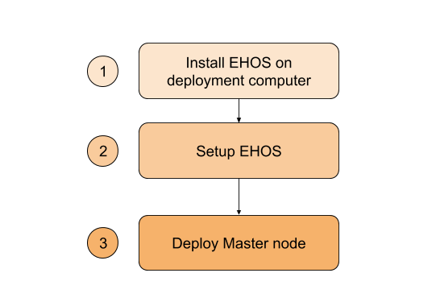

# Automatic configuration and installation of EHOS

These are the instructions for automatically configuring and deploying
EHOS on a virtual machine (VM) in an OpenStack environment in three
easy steps as outlined here: 

1) Install ehos and dependencies on the deployment computer
2) run script that configures the openstack firewall, uploads ssh keys and creates the necessary VM images
3) deployment of the ehos daemon on a newly created VM

The full installation documents can be found here
[here](installation_full.md) and covers in greater detail the inner
workings of, and how to deploy, ehos in various environments.

## Installing EHOS on the deployment computer.

The deployment computer needs to have python 3.4 (or later) and wget installed
to be able to use the setup & deployment scripts

### Configuration files:

There are two types of configuration files, one is to control the
behaviour of the ehos deployment script and daemon and the others for
installing and configuring the compute nodes. The files can be found
in share/. Upon alteration it is recommended to place the altered file
in etc/ to distinguish them from the original template ones. Unless
you want to install additional software on the execution nodes you
should only need to alter the ehos.yaml file.

#### EHOS daemon connection and behaviour configuration file

There is an example **etc/ehos.yaml.example** file provided. This will
needed to be renamed to etc/ehos.yaml and credentials for openstack
connection filled in, eg: username, password, vm-image etc. The
remainder of the file regards the behaviour of the ehos daemon, like
the max number of nodes to create etc, and htcondor specific
customisation. The template-file, with its comments, should be self
explanatory. In the HTCondor section it is important to change the
password to something unique as this restricts what nodes are allowed
to connect to the EHOS instance.


#### VM creation files

The configuration files for VM creation are all cloud-init files in
yaml format. These configuration files can either be used as is or as
templates for tweaking the system. Notice that all the files have been
created for centos 7 systems, so alterations might be required if your
system differs from this.

## Installation of  EHOS 

```bash
# create a python 3.X virtual environment, download EHOS and install the EHOS requirements.
virtualenv -p python3 ehos
#create and activate your ehos python virtualenv
cd ehos

# for bash
source bin/activate

# for (t)csh
source bin/activate.csh

# install ehos v1.0.0-rc1 along with various requirements:
pip install git+https://github.com/elixir-no-nels/ehos-python/@v1.0.0-rc1


# copy config template to etc/ directory:
cp etc/ehos/ehos.yaml.example etc/ehos/ehos.yaml

# add openstack connection credentials & alter ehos behaviour if needed.
vim etc/ehos/ehos.yaml

#If needed for some reason:
#To deactivate virtualenv:
deactivate
```


## setup openstack firewall, upload ssh key and create image(s)


## Creating the ehos image(s)

This script configure and makes the openstack environment ready to run EHOS.
The following steps are (or can be) preformed by the ehos_setup.py script: 
Automate the process of creating the image(s) on all
region(s)/project(s) specified in your ehos.yaml file, this script
will furthermore configure the firewall rules so the nodes can 
communicate together, upload a ssh key so you can connect to 
the master/execution node(s). 

```bash
# setup the openstack specific requirements for running ehos.
# run ./bin/ehos_setup.py -h for all options
# The more -v's you add the more loggin will you get.

# Please be aware that this will take a few minuttes for each cloud to be initialised 

# for a single region/private ehos:
./bin/ehos_setup.py -c -s ~/.ssh/id_rsa.pub -S ehos_ssh  -i -f ehos_firewall etc/ehos/ehos.yaml

# for a multi region/public ehos:
./bin/ehos_setup.py  -c -s ~/.ssh/id_rsa.pub -S ehos_ssh  -e -f ehos_firewall etc/ehos/ehos.yaml

```


## Create the master node & run the EHOS daemon

It is important that you have moved any modified config files into the
etc directory as these will then automatically be copied across to the
master node, along with the ehos.yaml file.

This script will install EHOS on the masternode. The commands to either 
run ehos-daemon on the commandline or as a systemd service is provided.


```bash
# create VM, install software, start EHOS. Again this will take a few minuttes so be patient.
./bin/ehos_deployment.py etc/ehos/ehos.yaml
# This will print the IP address and ID for the master node. 
# Please note this down as you will need to connect to the master


#Deactivate virtualenv:
deactivate

# logon to the master node
ssh [MASTER-NODE-IP]

# start ehos-daemon manually:
# Start up the ehos sever, adding some -v will increase the logging amount:
/usr/local/bin/ehosd.py -v -v -v /usr/local/etc/ehos/ehos.yaml

To run is as a systemd service:

# or run it as as systemd service
systemctl enable ehos.service
systemctl start ehos.service

```

## Testing the installation

The EHOS package installs a script that is suitable for testing the
EHOS installation. The script submits a set of jobs to the HTCondor
queue that executes a sleep command on the execution nodes. Running
the command without any parameters and you will get the full list of
possible modifications as number of jobs, sleep intervals etc.

Note that this should be run on the master node, and cannot be done
with a sudo (or if you became root with sudo -s).

```bash
# Submit 10 jobs, sleeping randomly between 30 and 50 seconds 
condor_run_jobs.py -n 10 -r 30,50

# Submit 10 jobs, each sleeping for 20 seconds
condor_run_jobs.py -n 10 -s 20

# expected output:
INFO:ehosd:Nr of jobs 12 (12 are queueing)
INFO:ehosd:We got stuff to do, creating some additional nodes...
WARNING:ehos:Could not create execute server
INFO:ehosd:Napping for 10 second(s).
INFO:ehosd:Nr of nodes 2 (0 are idle)
INFO:ehosd:Nr of jobs 12 (10 are queueing)
INFO:ehosd:We got stuff to do, creating some additional nodes...
WARNING:ehos:Could not create execute server
INFO:ehosd:Napping for 10 second(s).
INFO:ehosd:Nr of nodes 3 (0 are idle)
INFO:ehosd:Nr of jobs 10 (8 are queueing)
INFO:ehosd:We got stuff to do, creating some additional nodes...
WARNING:ehos:Could not create execute server
INFO:ehosd:Napping for 10 second(s).
INFO:ehosd:Nr of nodes 3 (0 are idle)
INFO:ehosd:Nr of jobs 8 (5 are queueing)

```
